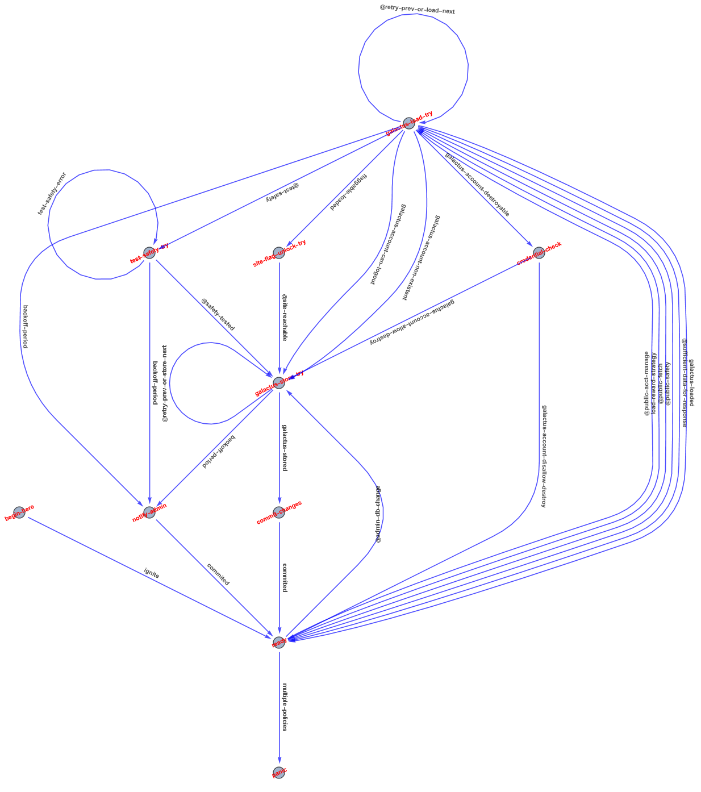

# GALACTUS

## Overview

Galactus is the cortex of the Interlock Network. It coordinates blockchain-activities
(like setting staking yields and limits) and browser-activities (like communicating
with the [ThreatSlayer](https://chrome.google.com/webstore/detail/threatslayer-security-phi/mgcmocglffknmbhhfjihifeldhghihpj) extension to protect users, and to reward them for their browsing
activities). There is also some book-keeping involved, like memorizing user-configs.

Given its central role, it is designed to be robust from the very beginning. We have
organized the code as a state-machine, with explicit states and events, and assertions
that validate the consistency of the program at the beginning and end of every transition,
as well as on every write to any core, non-primitive object (i.e. galactus accounts).
The idea is to prevent mistakes ahead of time, instead of desperately trying to find and
fix the mistakes while the program actively causes damage (or -- in the best case -- refuses
to run).

We have also adopted the notion of stacks and concatenative programming for encoding
computations into transitions. We adopt the style of PushGP (where each major data-type
has its own stack) and Harel's statecharts (where computations happen in the interstice
betwee states -- the transtions). We implementent the concatenative/stack-based _notation_
using the very common fluent-programming style (i.e. `a.b().c().d().e()`).

A major advantage of combining fluent-programming with type-segragated stacks, is that
we get a **mostly** point-free style of programming (i.e. agglutinations of verbs but no
nouns -- only constructor-verbs take arguments, because those are a wholistic chunk of meaning --
which means that most code can be safely copy-pasted anywhere without having to rename anything),
and an **extremely** flexible and forgiving combinatory mode of expression 
(i.e. in `x.num(1).num(2).str('1').str('2').add().cat()`
we can swap the string and number operations with each other and get the same
result, because each stack represents its own computational continuity -- which
can provide obvious opportunities for parallelization, but that is more of an
aspiration).

Modeling the program as a set of unique states connected by unique transitions that
are triggered by unique events, gives coders the opportunity to program new features in an
append-only style (i.e. we rarely have to **change** code in existing transitions,
we just have to add new transitions and new states, while leaving everything else
as-is). Bug fixes are a different matter, and require modification, but such
modifiations are usually append-only affairs _internally_, if they require the addition/removal
of a new verb to the fleunt-call-chain. In fact, every single transition was implemented by
copying the original transition `begin-here -> ready`, renaming it, and replacing its
body, while keeping the boilerplate intact (there must be a way to reduce boilerplate with
decorators, but we have been too busy to look), and just passing the `(src, dst, event, trans_func)`
arguments to the `add_transition` method.

Fixing the internals of _verbs themselves_ will resemble the kinds of fixes that you are used
to doing in traditional code-bases, because the verb-internals are implemented using
variables. That said, most verbs lack complicated branching structures, because most
of branching is handled by the events and transitions in the state-machine. Some
transitions contain internal branches on events (i.e. getters for objects would create
dozens of unneccessary transitions, for no additional benefit). Some verbs are context
sensitive and branch extensively on context (i.e. the `data_load` and `data_store` verbs
need to branch on a context-object to know which stack to push the data to, and also how
to deserialize the returned data-rows).

The verbs are analogous to the system-calls given by an operating system to its application
-- they connect the endogenous logic of the program to the exogenous reality of the world.
They present a clean separation between the _spirit_ of the program and the _manifestation_
of that spirit in the external world. The verbs modify the stacks, and they emit events
(which the statemachine then reacts to). To modify the stacks, the verbs need to use the
push/pop/peek methods, which check for access-priviledges (each verb must specify ahead of time
which stacks it intends to read and write from -- this catches a surprising number of bugs
early on). Just like a system-call, a call into a verb passes control from the state-machine 
(encoded in the `Endo` class) to the `Exo` class which is where the verbs are
implemented -- these 2 classes communicate via the stacks, passing control back and forth
between each other.

Unlike Harel's statecharts, which distinguish between events (missable external
signals from the outside world) and _conditions_ (boolean values derived from
data internal to the program-memory), we overload the events and handle the
distinction in the verb itself -- this allows us to easily create stochastified
mocks, inside the verbs, to exercise all transitions without having to stress
over the semantic distinction between an event and a condition.

Another deviation from Harel is that we do not have nestable states, we instead
find that in-verb branching and event-branching transitions (i.e. those that
are activated by event-sets) achieve a similar effect, while keeping the
topology simple (i.e. a transition from `load` to `respond` is semantically the
same concept regardless of what is being loaded and what kind of response is
created -- those details are best revealed by the code, since trying to infer
them from event-names is basically guesswork).

Overall, these abstractions give us an infinite number of ways to organize and
express the same computation, letting the developers choose whether the
computation is best expressed (and easiest to understand) on the level of
states and transitions, transition-branches, verb compositions, or murky
verb-internals. However, expressiveness is often at odds with tractability,
and so we provide facilities for specifying correctness-truths about the relations
between all states, events, stacks, and classes which should prevent developers
from over-expressing themselves into a dark corner of tangled logical
convolutions.

We use the `hypothesis` framework to generate test data and to drive event/data-inputs
into the state-machine. If any assertion gets triggered, hypothesis tries to create
the smallest possible input-sequence that would trigger the assertion.

Below is a state-transition-diagram representing the galactus code-base. Merged
transitions are identifiable by the `@` that prefixes their event-name. The
event-name text is written in the _direction of the transition_ (i.e. if the transition
points downwards, then the name must be read from top to bottom).



At a glance, you can tell that only admin-events may write to the db directly,
while all others must pass through a load-phase (usually to autheticate or to
fetch a resource). You can also see that admins receive notifications only after
retryable operations exceed their retry-limit. It is also obvious that loading,
storing, and safety-checking are the only retryable operations (so far). It is
apparent that we explicitly require that you provide credentials for account destruction
(even if you are already logged in). To put this in quantitative terms, this
diagram represents 4.5k lines of code in a single screenfull.

Because we are explicit about our states and transitions, the semantics of our verbs,
and the correctness constraints between all elements of the program, we can confidently
engage in refactors and even total rewrites (perhaps to entirely different languages)
because the notion of **what makes a correct galactus** is not defined in terms of
any concepts that are endemic to Python or to any of the modules (i.e. fastapi, sqlalchemy, etc)
that we use.

## Cool Features
### Tests / Fuzzing
#### Single Machine
#### Parallel Machines
### Heatmaps
### Stochastification

## Deployment

Galactus is meant to be run on NixOS with **one** worker-process. We increase the number
of workers in the future, and may want to use the `gunicorn` backend to allow for live,
zero-downtime upgrades. Using a single worker is fine, and reduces the number of error-sources
significantly -- Node.js apps usually run in a single thread/worker, it is in fact their whole
selling point. Also much confusion results from -- based on various online readings -- running
FastAPI with multiple workers without really understanding what that means. In any case,
we start with 1 and grow to multiple workers later.

We also use SQLite for development and testing -- which is another reason to use 1 worker --
but we plan to deploy on Postgres in production (we will have to update the configuration.nix file for this).

To run the code, you have to clone this repo into a directory and run the following:

```
nix-shell shell.nix
uvicorn core:app --host  $YOUR_IP --port 80 --workers 1
```

If you do not specify an IP, it will run on 127.0.0.1 and will only be visible to localhost-clients.
If you want a different port, you have to specify it -- the uvicorn default is 8000. And the workers
should never be increased unless we have tested and verified that more workers is stable. (So far,
the only thing that changes with multiple workers and a shared DB, is that if 2 workers try to create
the same user-account they will race, and 1 will create it successfully while the other will fail to
do so in a non-retryable way because of a primary-key-conflict -- a single worker-prevents this server-side,
but users can still perceive a race client-side, if the client show the username as being available and **another**
client completes registration before the current one does). Another possible race-condition is when the
same user visits a 2 sites from 2 clients and those arrive to galactus at the same time: with multiple
workers (but not with only 1 worker), this can result (unlikely but possibly) in
the meters getting incremented only once instead of twice. There are ways to prevent and mitigate this
(i.e. enclosing each ready-exit and ready-entry in a serializable transaction, or making such updates
diff/log/queue-oriented, and having a periodic worker reduce the diff-log into a single value), but
for now we are going with the simple solution of running one worker until it becomes a problem.

# Credits/Acknowledgements/Related-Work

* https://www.wisdom.weizmann.ac.il/~harel/SCANNED.PAPERS/SemanticsofStatecharts.pdf
* https://www.wisdom.weizmann.ac.il/~harel/papers/RhapsodySemantics.pdf
* https://github.com/TritonDataCenter/node-mooremachine
* https://en.wikipedia.org/wiki/De\_Bruijn\_notation
* https://en.wikipedia.org/wiki/De\_Bruijn\_index
* https://plato.stanford.edu/entries/logic-combinatory/
* https://crypto.stanford.edu/~blynn/lambda/cl.html
* https://plato.stanford.edu/entries/logic-linear/
* https://web.archive.org/web/20190212005350/home.pipeline.com/~hbaker1/LinearLisp.html (html of next)
* https://hashingit.com/elements/research-resources/1992-08-LinearLisp.pdf (pdf of prev)
* https://www.youtube.com/watch?v=AfaNEebCDos (property based testing at Ericson)
* https://hypothesis.works/
* https://en.wikipedia.org/wiki/White-box\_testing
* https://en.wikipedia.org/wiki/Design\_by\_contract
* https://www.pathsensitive.com/2023/03/modules-matter-most-for-masses.html
* TODO find link to Dan McDonald's talk about dynamic ASSERTs from dtrace.conf(16)
* https://github.com/nickziv/libslablist (example repo with dtrace-enabled asserts)
* https://plato.stanford.edu/entries/logic-modal/
* https://plato.stanford.edu/entries/logic-temporal/
* https://plato.stanford.edu/entries/logic-hybrid/
* https://lamport.azurewebsites.net/tla/book-02-08-08.pdf
* The Art of Computer Systems Performance Analysis by Raj Jain (Chapters 24 to 29)
* https://en.wikipedia.org/wiki/Exponential\_backoff
* https://martinfowler.com/bliki/FluentInterface.html
* Thinking Forth by Leo Brodie (reread Chapters 2 and 8 in retrospective context)
* https://faculty.hampshire.edu/lspector/pubs/push-gpem-final.pdf (PushGP intro)
* https://faculty.hampshire.edu/lspector/pubs/push3-gecco2005.pdf (PushGP combinators)
* https://www.youtube.com/watch?v=VGJWlSC0gl4 (PushGP fast intro)
* https://xpqz.github.io/learnapl/intro.html
* https://code.jsoftware.com/wiki/Essays
* https://www.jsoftware.com/help/jforc/contents.htm
* https://raw.githubusercontent.com/codereport/Content/main/Publications/Combinatory\_Logic\_and\_Combinators\_in\_Array\_Languages.pdf
* https://mlochbaum.github.io/BQN/index.html
* https://www.youtube.com/watch?v=\_IgqJr8jG8M (cat/kitten lang)
* https://www.youtube.com/watch?v=faHB4MGQIG8 (concatenation and creativity)
* More to come
